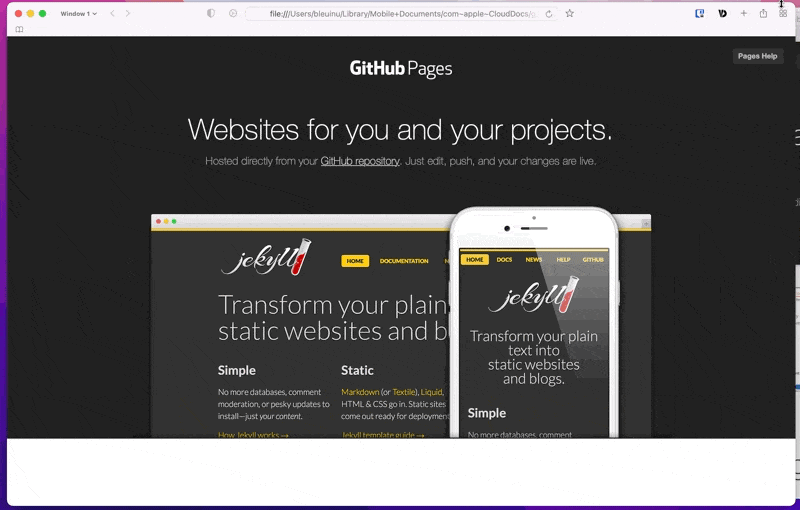

# GitHub Pages Clone

Original: https://pages.github.com

Stack
- HTML5
- CSS
- JavaScript

---

2022-06-25
- Finished hero portion (top first section) UI completed (NOT responsive yet).

2022-06-29
- Finished video section.
    - why used `<iframe></iframe>` instead of `<video></video>`?
- Started tutorial section.
    - original source uses an anchor tag (`<a>`) but I thought `<button>` suits more here since we're not really navigating anywhere.

